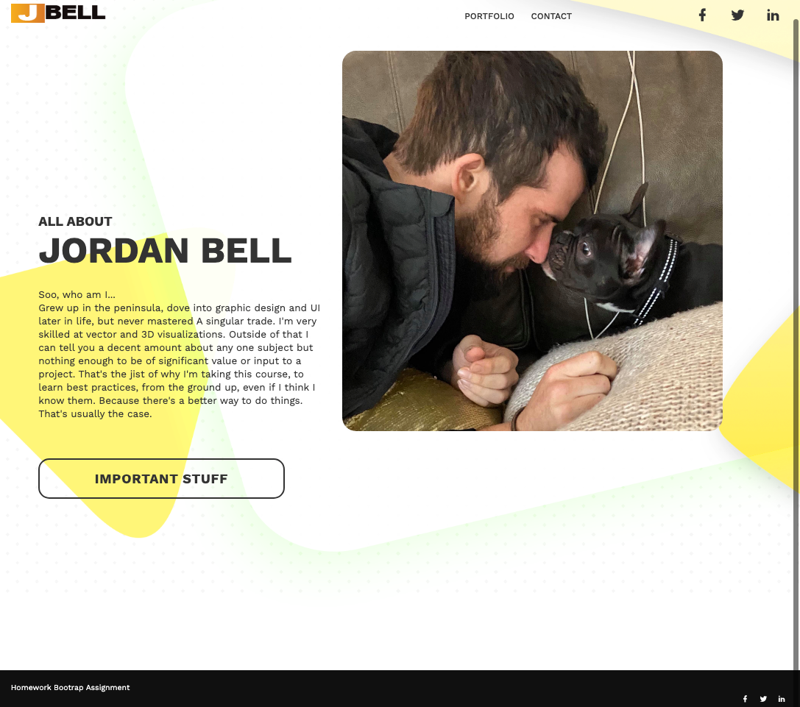

# homework--BCS -- Responsive Bootrap Assignmenr
Second Homework 

* Create the following files files: `index.html`, `portfolio.html` and `contact.html`.

* Using Bootstrap, develop your portfolio site with the following items:

   * A navbar

   * A responsive layout

   * Responsive images

* The Bootstrap portfolio should minimize the use of media queries.

Committed to Github @ https://github.com/ReverbDesigns/Bootstrap-Responsive-Site-Homework.git
 Hosted on GitHub pages @ https://reverbdesigns.github.io/Bootstrap-Responsive-Site-Homework/

 